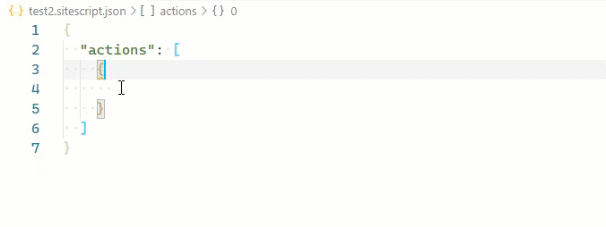

# SharePoint Site Design JSON Schema extension

Add snippets to the JSON schema for SharePoint site script actions.

## Features

This extension will download the current JSON schema for SharePoint Site Design script actions and process the file to:
- correct errors in schema
- inject snippets for VSCode

The code snippets for the `verb` attribute:

The local, enhanced copy of the schema is downloaded when a site script json file is added to the workspace. A site script file is identified by matching the pattern `*.sitescript.json`

## Commands

**SiteDesign: Refresh local schema**

The refresh command will download and process the official JSON schema document (https://developer.microsoft.com/json-schemas/sp/site-design-script-actions.schema.json").

## JSON Schema association

Files with the suffix `.sitescript.json` are associated with local, enhanced schema file ({extensionPath}/sharepoint.sitescript.json)
